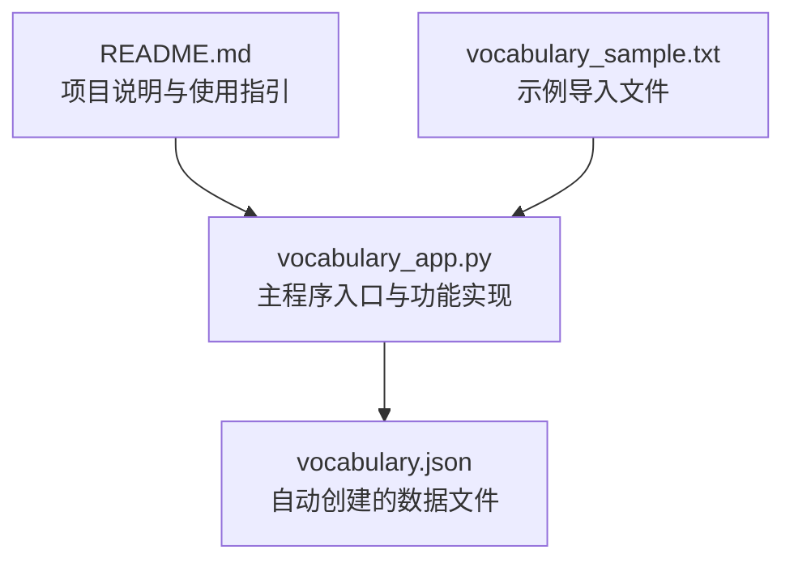
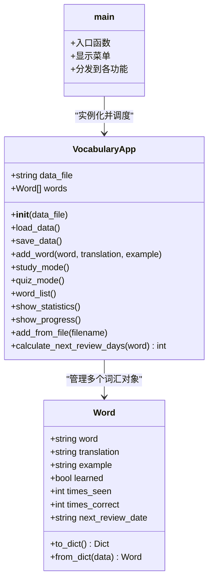
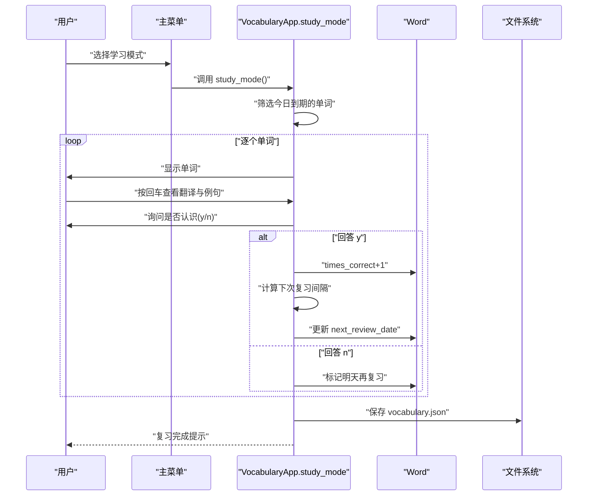
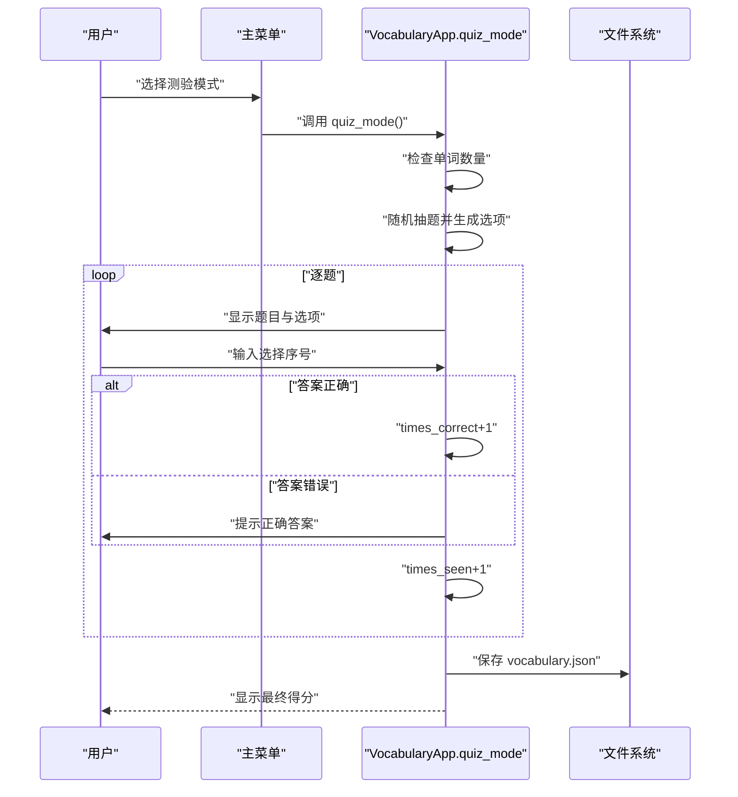
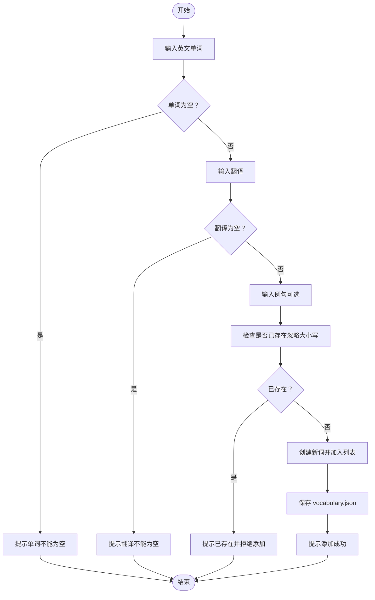
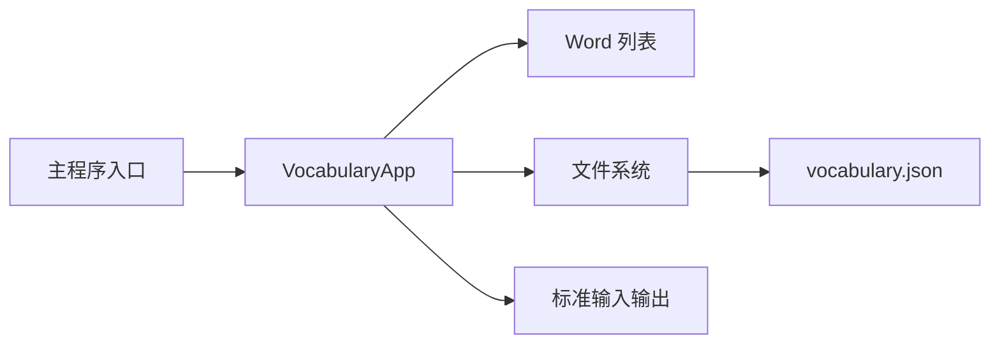

# 使用方法

<cite>
**本文引用的文件**
- [README.md](file://README.md)
- [vocabulary_app.py](file://vocabulary_app.py)
- [vocabulary_sample.txt](file://vocabulary_sample.txt)
</cite>

## 目录
1. [简介](#简介)
2. [项目结构](#项目结构)
3. [核心组件](#核心组件)
4. [架构总览](#架构总览)
5. [详细组件分析](#详细组件分析)
6. [依赖关系分析](#依赖关系分析)
7. [性能与使用建议](#性能与使用建议)
8. [故障排查指南](#故障排查指南)
9. [结论](#结论)
10. [附录：输入格式与示例](#附录输入格式与示例)

## 简介
本指南面向普通用户，帮助您从零开始运行并高效使用“背单词”词汇学习应用。您将学会：
- 如何启动程序并理解主菜单各选项
- 学习模式（复习）与测验模式（多选测试）的完整交互流程
- 手动添加新词的输入规范
- 查看词汇列表与统计信息的输出格式
- 通过文本文件批量导入词汇的方法
- vocabulary.json 文件的自动生成与数据持久化机制

本应用基于 Python 实现，具备间隔重复算法、进度统计、进度概览等功能，适合日常英语或目标语言词汇学习。

## 项目结构
仓库包含三个核心文件：
- README.md：项目说明、特性、使用方法与数据保存位置
- vocabulary_app.py：主程序，包含 Word 类与 VocabularyApp 应用类、主菜单循环与各功能实现
- vocabulary_sample.txt：示例词汇文件，演示导入格式与内容

图表来源
- [README.md](file://README.md#L1-L46)
- [vocabulary_app.py](file://vocabulary_app.py#L322-L374)
- [vocabulary_sample.txt](file://vocabulary_sample.txt#L1-L33)

章节来源
- [README.md](file://README.md#L1-L46)
- [vocabulary_app.py](file://vocabulary_app.py#L322-L374)
- [vocabulary_sample.txt](file://vocabulary_sample.txt#L1-L33)

## 核心组件
- Word 类：封装单个词汇对象，包含英文单词、翻译、例句、学习状态与复习计划等字段，并提供序列化/反序列化方法
- VocabularyApp 类：应用主体，负责加载/保存数据、维护词汇列表、实现学习模式、测验模式、列表展示、统计与进度概览、从文件导入词汇等
- 主程序入口：提供主菜单循环，调用 VocabularyApp 的对应方法

章节来源
- [vocabulary_app.py](file://vocabulary_app.py#L13-L84)
- [vocabulary_app.py](file://vocabulary_app.py#L51-L120)
- [vocabulary_app.py](file://vocabulary_app.py#L322-L374)

## 架构总览
应用采用“类驱动”的模块化设计：
- 数据模型层：Word 类定义词汇实体
- 应用逻辑层：VocabularyApp 封装业务逻辑与持久化
- 用户交互层：主菜单循环处理用户选择并调用相应方法
- 文件系统层：读写 vocabulary.json 与导入文件

图表来源
- [vocabulary_app.py](file://vocabulary_app.py#L13-L84)
- [vocabulary_app.py](file://vocabulary_app.py#L51-L120)
- [vocabulary_app.py](file://vocabulary_app.py#L322-L374)

## 详细组件分析

### 启动与主菜单
- 运行方式：在终端执行命令以启动应用
- 主菜单选项：
  - 学习模式：复习待复习单词
  - 测验模式：多选测试
  - 添加新词：手动录入
  - 查看词汇列表：按复习计划排序展示
  - 查看统计：总体进度与准确率
  - 进度概览：按日期统计即将到来的复习任务
  - 从文件添加：批量导入
  - 退出

章节来源
- [README.md](file://README.md#L17-L31)
- [vocabulary_app.py](file://vocabulary_app.py#L322-L374)

### 学习模式（复习）
- 触发条件：选择主菜单第1项
- 工作流程：
  1) 筛选今日到期的单词（根据 next_review_date）
  2) 随机打乱后逐个呈现
  3) 先显示单词，按回车查看翻译与例句
  4) 询问是否认识该词（y/n），依据回答更新 times_correct、times_seen 与 next_review_date
  5) 保存数据并提示本次复习完成

图表来源
- [vocabulary_app.py](file://vocabulary_app.py#L108-L159)

章节来源
- [vocabulary_app.py](file://vocabulary_app.py#L108-L159)

### 测验模式（多选测试）
- 触发条件：选择主菜单第2项；至少需要4个单词才可进行
- 工作流程：
  1) 随机抽取最多10个单词组成测验
  2) 对每个单词显示四个选项（含正确答案与三个随机干扰项）
  3) 用户输入序号作答，记录正确/错误并更新 times_correct/times_seen
  4) 显示得分与正确率
  5) 保存数据

图表来源
- [vocabulary_app.py](file://vocabulary_app.py#L177-L224)

章节来源
- [vocabulary_app.py](file://vocabulary_app.py#L177-L224)

### 手动添加新词
- 触发条件：选择主菜单第3项
- 输入要求：
  - 英文单词：必填且不可为空
  - 翻译：必填
  - 例句：可选
- 重复性检查：不区分大小写，若已存在则提示并拒绝重复添加
- 成功后立即保存数据

图表来源
- [vocabulary_app.py](file://vocabulary_app.py#L340-L355)
- [vocabulary_app.py](file://vocabulary_app.py#L93-L106)

章节来源
- [vocabulary_app.py](file://vocabulary_app.py#L340-L355)
- [vocabulary_app.py](file://vocabulary_app.py#L93-L106)

### 查看词汇列表
- 触发条件：选择主菜单第4项
- 输出格式要点：
  - 按“已掌握/未掌握”与“下次复习日期”排序
  - 每条目包含：序号、勾选/圆圈状态、英文单词、中文翻译、复习状态（今日/逾期/还剩X天）
  - 若有例句，会额外显示

章节来源
- [vocabulary_app.py](file://vocabulary_app.py#L225-L254)

### 查看统计信息
- 触发条件：选择主菜单第5项
- 统计维度：
  - 总词数、已掌握词数、掌握进度百分比
  - 当前待复习词数
  - 学习总次数、总体准确率
  - 平均每词掌握程度（按正确率/见过次数加权）

章节来源
- [vocabulary_app.py](file://vocabulary_app.py#L254-L284)

### 进度概览（按日期统计）
- 触发条件：选择主菜单第6项
- 输出格式要点：
  - 按 next_review_date 分组统计
  - 显示“今天/已过X天/还剩X天”的人性化描述
  - 每日条目包含日期与该日复习数量

章节来源
- [vocabulary_app.py](file://vocabulary_app.py#L285-L320)

### 从文件批量导入词汇
- 触发条件：选择主菜单第7项
- 默认文件名：如未输入文件名，默认使用 vocabulary_sample.txt
- 导入格式要求：每行一条，格式为“英文单词,中文翻译,例句（可选）”
  - 英文单词与中文翻译为必填
  - 例句可选，若包含逗号需用双引号包裹
- 成功导入后会保存数据

章节来源
- [README.md](file://README.md#L32-L46)
- [vocabulary_app.py](file://vocabulary_app.py#L361-L366)
- [vocabulary_sample.txt](file://vocabulary_sample.txt#L1-L33)

### 数据持久化与 vocabulary.json
- 自动生成：首次运行时若不存在 vocabulary.json，则会创建内置示例词汇并保存
- 读取策略：每次启动先尝试读取 vocabulary.json；失败则清空内存并创建示例
- 写入策略：任何新增/修改（学习模式、测验模式、手动添加、导入）都会触发保存
- 保存异常：保存失败会打印错误信息但不影响继续使用

章节来源
- [README.md](file://README.md#L44-L46)
- [vocabulary_app.py](file://vocabulary_app.py#L59-L84)
- [vocabulary_app.py](file://vocabulary_app.py#L85-L92)

## 依赖关系分析
- 内部依赖：
  - VocabularyApp 依赖 Word 对象集合
  - 主程序入口依赖 VocabularyApp
- 外部依赖：
  - 文件系统：读写 vocabulary.json 与导入文件
  - 标准库：json、random、os、datetime、typing

图表来源
- [vocabulary_app.py](file://vocabulary_app.py#L322-L374)
- [vocabulary_app.py](file://vocabulary_app.py#L51-L120)

章节来源
- [vocabulary_app.py](file://vocabulary_app.py#L322-L374)
- [vocabulary_app.py](file://vocabulary_app.py#L51-L120)

## 性能与使用建议
- 学习模式与测验模式均会对数据进行保存，频繁操作不会造成数据丢失风险
- 若词汇量较大，建议定期使用“查看统计”与“进度概览”了解学习节奏
- 间隔重复算法会根据答题正确率动态调整复习周期，合理安排复习频率可提升记忆效果

[本节为通用建议，无需引用具体文件]

## 故障排查指南
- 启动后无数据或报错：
  - 检查 vocabulary.json 是否被意外删除或损坏
  - 程序会在找不到文件时自动生成示例数据；若仍异常，请确认 Python 环境与权限
- 保存失败：
  - 程序会打印错误信息；请检查磁盘空间与文件权限
- 导入失败：
  - 确认文件路径正确，且每行符合“英文单词,中文翻译,例句（可选）”格式
  - 若例句中包含逗号，请用双引号包裹
- 无法进入测验：
  - 至少需要4个单词才能开始测验

章节来源
- [vocabulary_app.py](file://vocabulary_app.py#L59-L84)
- [vocabulary_app.py](file://vocabulary_app.py#L85-L92)
- [vocabulary_app.py](file://vocabulary_app.py#L177-L182)
- [README.md](file://README.md#L32-L46)

## 结论
本应用提供了完整的词汇学习闭环：从手动添加、批量导入，到学习模式与测验模式的交互式训练，再到统计与进度概览，最后由 vocabulary.json 自动持久化保存。遵循本文档的输入规范与操作流程，您可以高效地建立并维护个人词汇库，稳步提升语言能力。

[本节为总结，无需引用具体文件]

## 附录：输入格式与示例

- 启动命令
  - 在终端执行：python vocabulary_app.py

- 主菜单选项
  - 1：学习模式（复习）
  - 2：测验模式（多选测试）
  - 3：添加新词（手动）
  - 4：查看词汇列表
  - 5：查看统计
  - 6：进度概览
  - 7：从文件添加（批量导入）
  - 8：退出

- 手动添加新词的输入要求
  - 英文单词：必填，不可为空
  - 中文翻译：必填
  - 例句：可选，可留空

- 批量导入文件格式
  - 每行一条，格式为“英文单词,中文翻译,例句（可选）”
  - 例句中包含逗号时，需用双引号包裹
  - 示例文件 vocabulary_sample.txt 展示了标准格式

- vocabulary.json 的自动生成与保存机制
  - 首次运行且不存在该文件时，程序会创建内置示例词汇并保存
  - 任何新增/修改操作（学习模式、测验模式、手动添加、导入）都会保存到该文件
  - 保存失败会打印错误信息，但不影响继续使用

章节来源
- [README.md](file://README.md#L17-L46)
- [vocabulary_app.py](file://vocabulary_app.py#L59-L84)
- [vocabulary_app.py](file://vocabulary_app.py#L85-L92)
- [vocabulary_sample.txt](file://vocabulary_sample.txt#L1-L33)