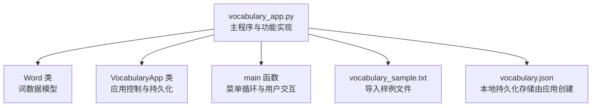
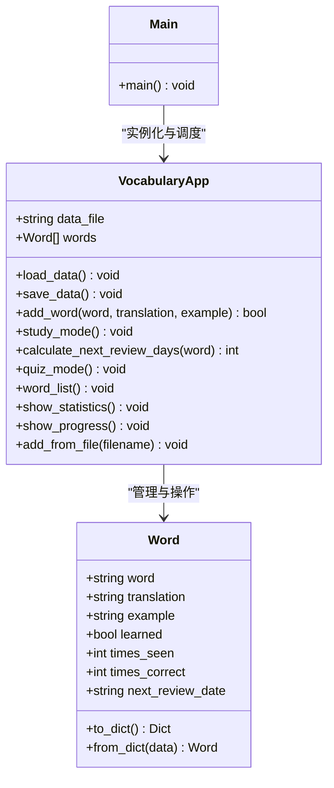
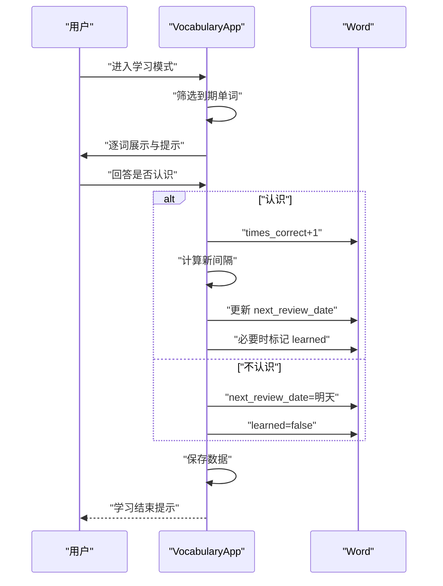
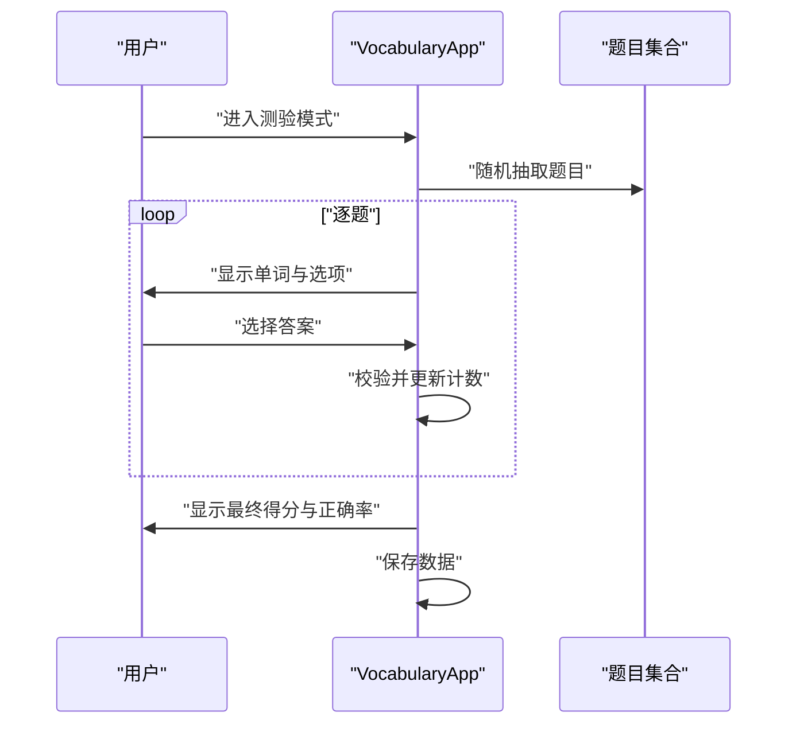
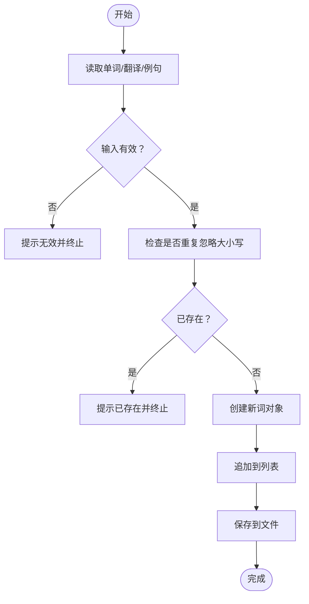
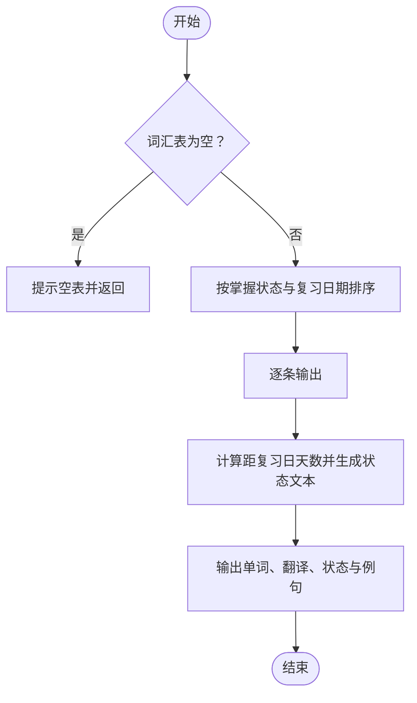
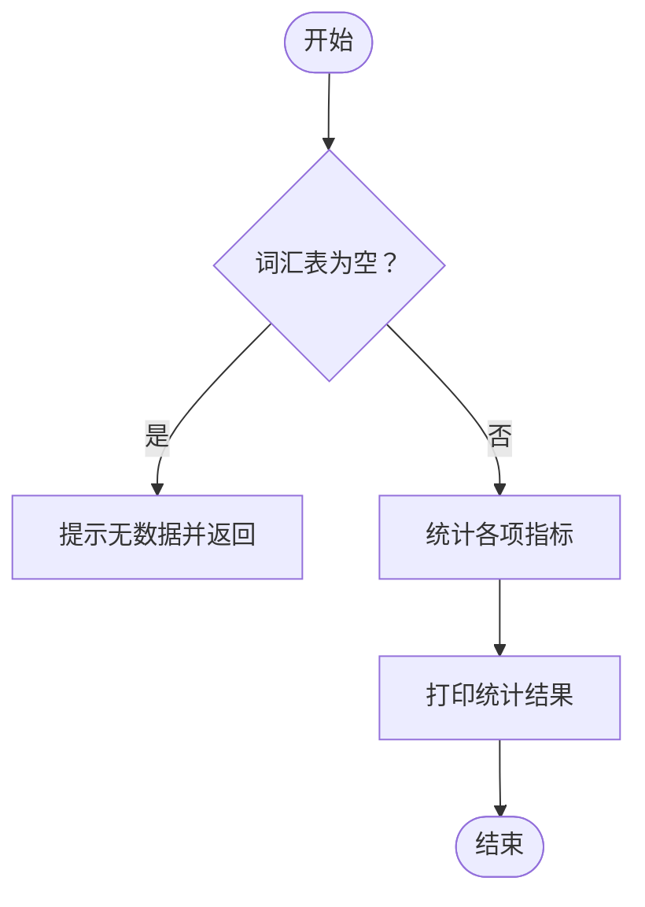
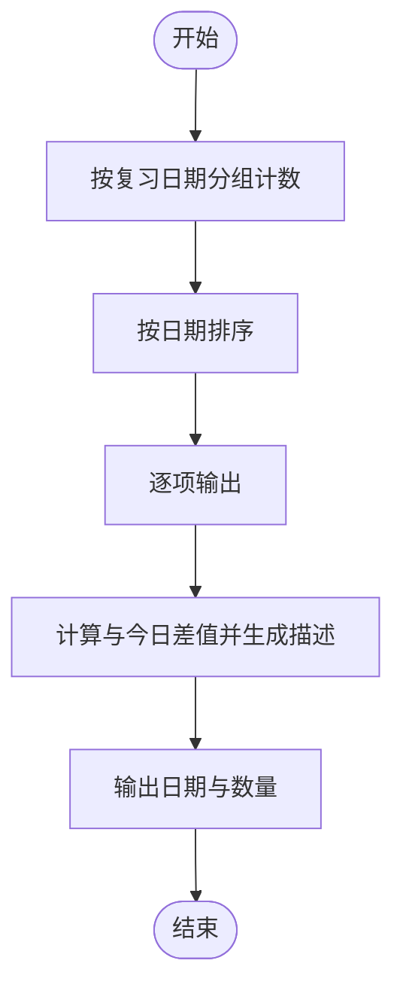
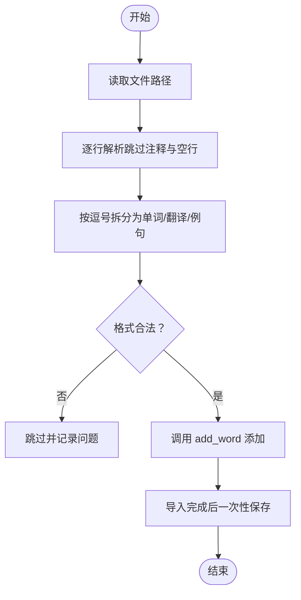
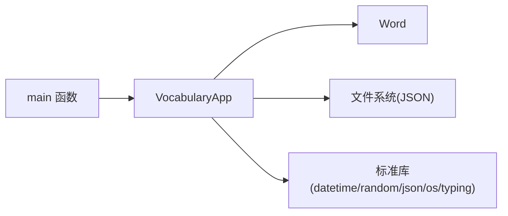

# 功能特性

<cite>
**本文引用的文件**
- [vocabulary_app.py](file://vocabulary_app.py)
- [README.md](file://README.md)
- [vocabulary_sample.txt](file://vocabulary_sample.txt)
</cite>

## 目录
1. [简介](#简介)
2. [项目结构](#项目结构)
3. [核心组件](#核心组件)
4. [架构总览](#架构总览)
5. [详细功能分析](#详细功能分析)
6. [依赖关系分析](#依赖关系分析)
7. [性能考量](#性能考量)
8. [故障排查指南](#故障排查指南)
9. [结论](#结论)
10. [附录](#附录)

## 简介
本应用是一个基于命令行的词汇学习工具，支持学习模式、测验模式、手动添加单词、查看词汇列表、查看统计、进度概览以及从文件导入等七大核心功能。系统采用简单的数据模型与本地JSON文件持久化，结合间隔重复算法驱动复习计划，帮助用户高效记忆目标词汇。

## 项目结构
- vocabulary_app.py：主程序入口，包含词类与应用类、菜单交互与各功能实现。
- vocabulary_sample.txt：示例导入文件，提供多行“单词,翻译,例句”的格式样例。
- README.md：使用说明、功能列表、导入格式与保存位置说明。

图表来源
- [vocabulary_app.py](file://vocabulary_app.py#L13-L49)
- [vocabulary_app.py](file://vocabulary_app.py#L51-L107)
- [vocabulary_app.py](file://vocabulary_app.py#L322-L374)
- [README.md](file://README.md#L1-L46)

章节来源
- [vocabulary_app.py](file://vocabulary_app.py#L1-L374)
- [README.md](file://README.md#L1-L46)

## 核心组件
- Word 类：封装单个词汇的数据字段与序列化/反序列化方法，用于持久化与内存表示。
- VocabularyApp 类：应用主体，负责加载/保存数据、执行学习与测验、管理词汇列表、统计与进度展示、以及导入功能。
- main 函数：提供菜单交互，将用户选择映射到具体功能。

章节来源
- [vocabulary_app.py](file://vocabulary_app.py#L13-L49)
- [vocabulary_app.py](file://vocabulary_app.py#L51-L107)
- [vocabulary_app.py](file://vocabulary_app.py#L322-L374)

## 架构总览
应用采用“数据模型 + 应用控制器 + CLI 交互”的分层设计：
- 数据模型层：Word 类承载词数据。
- 控制器层：VocabularyApp 类集中处理业务逻辑与状态更新。
- 表现层：CLI 输出与输入，配合持久化文件完成状态落地。

图表来源
- [vocabulary_app.py](file://vocabulary_app.py#L13-L49)
- [vocabulary_app.py](file://vocabulary_app.py#L51-L107)
- [vocabulary_app.py](file://vocabulary_app.py#L108-L176)
- [vocabulary_app.py](file://vocabulary_app.py#L177-L224)
- [vocabulary_app.py](file://vocabulary_app.py#L225-L320)
- [vocabulary_app.py](file://vocabulary_app.py#L322-L374)

## 详细功能分析

### 学习模式（Study Mode）
- 目标：根据复习日期筛选待复习单词，通过间隔重复算法动态调整下次复习时间。
- 关键逻辑
  - 筛选：按当前日期与 next_review_date 比较，选出到期单词。
  - 打乱顺序：随机打乱待复习单词，避免顺序依赖。
  - 逐词交互：显示单词、提示查看翻译与例句、记录“见过次数”。
  - 判定与更新：若用户回答“认识”，增加正确次数并调用间隔重复算法计算新间隔；若回答“不认识”，将 next_review_date 设为次日。
  - 标记已掌握：当正确次数达到阈值时标记为已掌握。
  - 持久化：每轮结束后保存数据。
- 间隔重复算法要点
  - 基于正确率与累计正确次数，返回下次复习天数。
  - 正确率低时缩短间隔，正确率高时延长间隔。
- 用户交互与状态更新
  - 输入“y/n”决定是否延长间隔或立即重排。
  - 内部状态包括 times_seen、times_correct、next_review_date、learned。

图表来源
- [vocabulary_app.py](file://vocabulary_app.py#L108-L176)

章节来源
- [vocabulary_app.py](file://vocabulary_app.py#L108-L176)

### 测验模式（Quiz Mode）
- 目标：通过多选题测试词汇掌握情况，生成干扰项并统计得分。
- 关键逻辑
  - 题目选择：从现有词汇中随机抽取若干题目（最多10个），确保数量不少于4个。
  - 干扰项生成：从其他单词的翻译中随机挑选，与正确答案合并后打乱顺序。
  - 评分与计数：用户选择后判断正误，更新 times_correct 与 times_seen。
  - 结果输出：打印分数与正确率，并保存更新后的数据。
- 用户交互与状态更新
  - 输入选项编号进行作答。
  - 内部状态随每次答题更新，影响后续统计与复习安排。

图表来源
- [vocabulary_app.py](file://vocabulary_app.py#L177-L224)

章节来源
- [vocabulary_app.py](file://vocabulary_app.py#L177-L224)

### 添加单词（Add a new word）
- 目标：向词汇表中新增一条记录。
- 关键逻辑
  - 重复检测：按单词名（不区分大小写）检查是否已存在，存在则拒绝添加。
  - 创建与入库：构造新词对象并追加到内存列表，随后保存至持久化文件。
- 用户交互与状态更新
  - 从命令行读取单词、翻译与可选例句。
  - 成功添加后立即持久化，保证数据安全。

图表来源
- [vocabulary_app.py](file://vocabulary_app.py#L93-L106)

章节来源
- [vocabulary_app.py](file://vocabulary_app.py#L93-L106)

### 查看词汇列表（View vocabulary list）
- 目标：以易读的方式展示全部词汇及其复习状态。
- 关键逻辑
  - 排序规则：先按“是否已掌握”，再按“下次复习日期”升序排列。
  - 状态展示：根据 next_review_date 与当前日期的关系，显示“已到期/今日/还剩X天/已过期X天”等人性化描述。
  - 可选例句：若存在例句则一并展示。
- 用户交互与状态更新
  - 仅展示，不修改任何状态。

图表来源
- [vocabulary_app.py](file://vocabulary_app.py#L225-L253)

章节来源
- [vocabulary_app.py](file://vocabulary_app.py#L225-L253)

### 查看统计（View statistics）
- 目标：聚合展示学习进度与整体表现。
- 关键指标
  - 总词数、已掌握词数、掌握进度百分比。
  - 当前待复习词数。
  - 总“见过次数”、总“正确次数”、总体准确率。
  - 平均单词掌握度（按每个词的正确率平均）。
- 用户交互与状态更新
  - 仅读取并计算，不修改任何状态。

图表来源
- [vocabulary_app.py](file://vocabulary_app.py#L254-L284)

章节来源
- [vocabulary_app.py](file://vocabulary_app.py#L254-L284)

### 进度概览（Progress overview）
- 目标：按日期维度展示即将到来的复习安排，形成时间轴视图。
- 关键逻辑
  - 分组计数：以 next_review_date 为键进行分组并统计数量。
  - 排序：按日期升序排列。
  - 人性化描述：根据与当前日期的差值，输出“今日/还剩X天/已过期X天”等描述。
- 用户交互与状态更新
  - 仅展示，不修改任何状态。

图表来源
- [vocabulary_app.py](file://vocabulary_app.py#L285-L320)

章节来源
- [vocabulary_app.py](file://vocabulary_app.py#L285-L320)

### 从文件导入（Add words from file）
- 目标：批量导入词汇，提升初始建库效率。
- 已知信息
  - 菜单中提供该选项，且调用了 add_from_file 方法。
  - 示例文件 vocabulary_sample.txt 提供了“单词,翻译,例句”的标准格式。
  - README 指明导入文件格式与保存位置（vocabulary.json）。
- 实现现状
  - 在主函数中调用了 add_from_file，但当前版本的 VocabularyApp 类中未发现该方法定义。
  - 因此，当前版本的“从文件导入”功能不可用。
- 建议实现方向
  - 解析指定文件，逐行读取并按逗号拆分，跳过注释行与空行。
  - 对每条记录调用 add_word，利用现有重复检测机制避免重复。
  - 导入完成后统一保存一次，减少多次写盘开销。
  - 提供错误处理与提示，如格式不合法、无法打开文件等。

图表来源
- [vocabulary_app.py](file://vocabulary_app.py#L322-L374)
- [README.md](file://README.md#L32-L46)
- [vocabulary_sample.txt](file://vocabulary_sample.txt#L1-L33)

章节来源
- [vocabulary_app.py](file://vocabulary_app.py#L322-L374)
- [README.md](file://README.md#L32-L46)
- [vocabulary_sample.txt](file://vocabulary_sample.txt#L1-L33)

## 依赖关系分析
- 内部依赖
  - VocabularyApp 依赖 Word 类进行数据封装与序列化。
  - 主菜单依赖 VocabularyApp 的各个方法实现具体功能。
- 外部依赖
  - 文件系统：通过 JSON 文件进行持久化。
  - 标准库：datetime、timedelta、random、json、os、typing。
- 潜在问题
  - “从文件导入”功能在当前代码中未实现，调用会失败。
  - 缺少异常处理与用户提示，建议在导入流程中加入更健壮的错误处理。

图表来源
- [vocabulary_app.py](file://vocabulary_app.py#L1-L374)

章节来源
- [vocabulary_app.py](file://vocabulary_app.py#L1-L374)

## 性能考量
- 时间复杂度
  - 学习/测验：线性遍历待复习/题目集合，O(n)。
  - 词汇列表：排序 O(n log n)，逐条输出 O(n)。
  - 统计与进度：线性扫描 O(n)。
- 空间复杂度
  - 以列表存储 Word 对象，空间 O(n)。
- 优化建议
  - 导入时批量保存，减少磁盘写入次数。
  - 词汇列表与进度视图可考虑缓存最近一次计算结果，避免频繁重复计算。
  - 若词汇量增长，可引入索引（如按复习日期分桶）以加速筛选。

## 故障排查指南
- 无法导入词汇
  - 现状：调用 add_from_file 但方法未实现。
  - 处理：在 VocabularyApp 中实现该方法，或暂时移除菜单中的导入选项。
- 重复添加单词
  - 现状：已有重复检测（不区分大小写）。
  - 处理：确认输入大小写差异不会导致误判；必要时在 UI 层提示用户。
- 数据丢失或损坏
  - 现状：数据保存在 vocabulary.json。
  - 处理：检查文件是否存在与权限；若损坏，可删除后重启应用自动重建示例数据。
- 测验题目不足
  - 现状：要求至少4个词才能开始测验。
  - 处理：先添加更多词汇后再进行测验。

章节来源
- [vocabulary_app.py](file://vocabulary_app.py#L93-L106)
- [vocabulary_app.py](file://vocabulary_app.py#L177-L184)
- [README.md](file://README.md#L44-L46)

## 结论
该应用以简洁的代码实现了完整的词汇学习闭环：从手动添加到自动复习，从练习测验到统计与进度概览。学习模式与测验模式分别覆盖“巩固记忆”和“检验掌握”的关键环节；统计与进度视图为用户提供清晰的学习反馈。当前版本在“从文件导入”方面尚有改进空间，建议尽快补齐该功能以提升用户体验。

## 附录
- 使用说明与导入格式参考 README。
- 示例导入文件 vocabulary_sample.txt 展示了标准格式。

章节来源
- [README.md](file://README.md#L1-L46)
- [vocabulary_sample.txt](file://vocabulary_sample.txt#L1-L33)