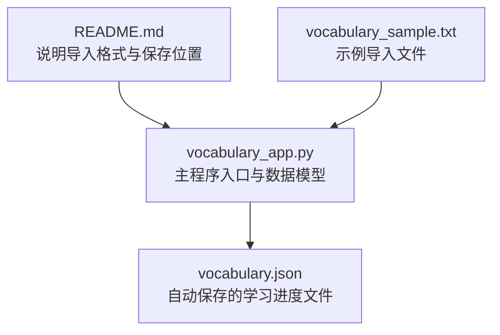
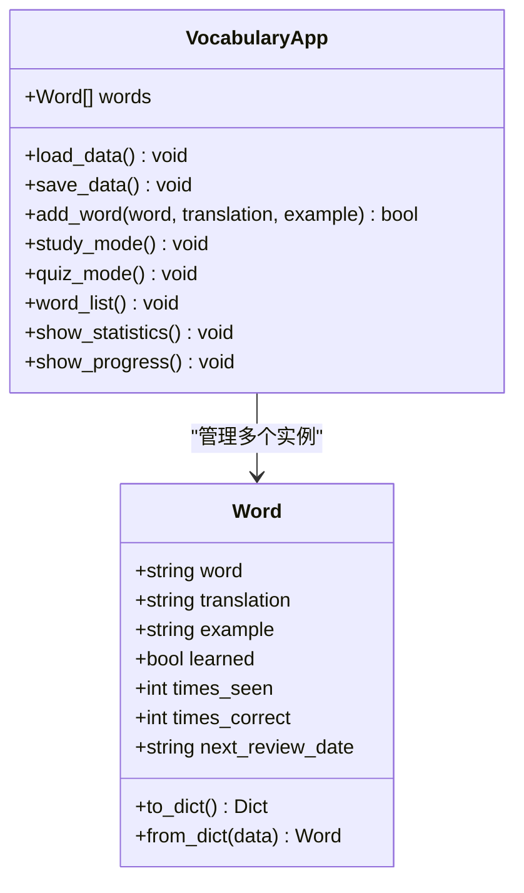
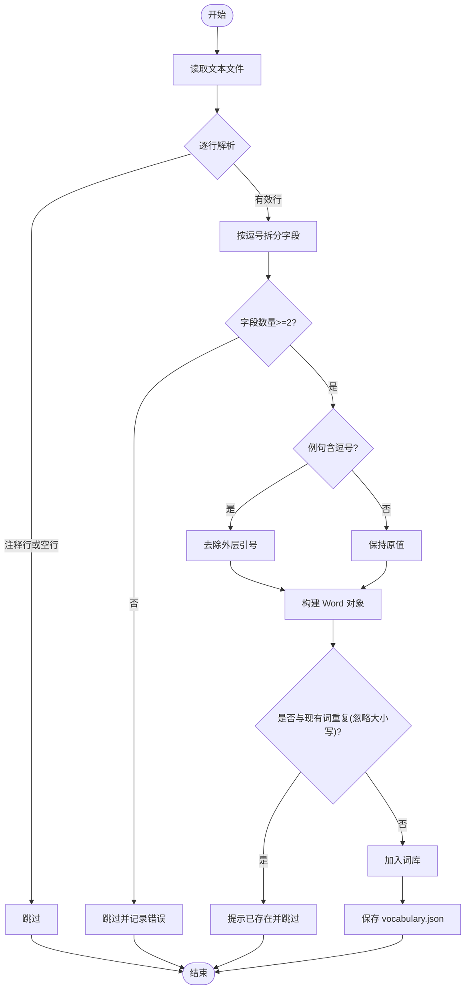
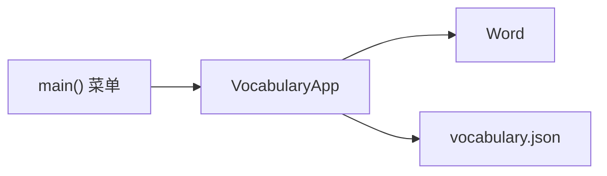

# 文件格式说明

<cite>
**本文引用的文件**
- [README.md](file://README.md)
- [vocabulary_app.py](file://vocabulary_app.py)
- [vocabulary_sample.txt](file://vocabulary_sample.txt)
</cite>

## 目录
1. [简介](#简介)
2. [项目结构](#项目结构)
3. [核心组件](#核心组件)
4. [架构总览](#架构总览)
5. [详细组件分析](#详细组件分析)
6. [依赖分析](#依赖分析)
7. [性能考虑](#性能考虑)
8. [故障排除指南](#故障排除指南)
9. [结论](#结论)
10. [附录](#附录)

## 简介
本文件面向使用者与开发者，系统性说明本项目支持的“文件导入格式”，重点聚焦于“CSV样式”的文本文件结构；并解释该格式与程序内部数据模型之间的映射关系。同时，说明用于持久化学习进度的 JSON 文件结构与管理方式，强调其由程序自动维护，不应手动编辑。

## 项目结构
- README.md：项目说明与导入格式示例
- vocabulary_app.py：主程序，包含数据模型、学习模式、统计与进度展示等
- vocabulary_sample.txt：示例导入文件，演示正确的 CSV 格式

图表来源
- [README.md](file://README.md#L32-L46)
- [vocabulary_app.py](file://vocabulary_app.py#L51-L92)
- [vocabulary_sample.txt](file://vocabulary_sample.txt#L1-L33)

章节来源
- [README.md](file://README.md#L1-L46)
- [vocabulary_app.py](file://vocabulary_app.py#L51-L92)
- [vocabulary_sample.txt](file://vocabulary_sample.txt#L1-L33)

## 核心组件
- 数据模型：Word 类封装单词、翻译、例句及学习状态字段
- 应用主体：VocabularyApp 类负责加载/保存数据、学习模式、测验模式、列表与统计展示
- 导入流程：从文本文件读取 CSV 行，解析为 Word 对象并加入词库

章节来源
- [vocabulary_app.py](file://vocabulary_app.py#L13-L49)
- [vocabulary_app.py](file://vocabulary_app.py#L51-L92)

## 架构总览
导入流程从用户选择“从文件添加单词”开始，程序读取指定文本文件，逐行解析为单词条目，随后写入内存词库并在退出或交互结束后持久化到 vocabulary.json。

```mermaid
sequenceDiagram
participant U as "用户"
participant M as "菜单(main)"
participant APP as "VocabularyApp"
participant FS as "文件系统"
participant JSON as "vocabulary.json"
U->>M : "选择选项7：从文件添加单词"
M->>APP : "调用 add_from_file(文件名)"
APP->>FS : "打开并读取文本文件"
FS-->>APP : "返回文件内容"
loop 遍历每一行
APP->>APP : "解析CSV行<br/>提取 word, translation, example"
APP->>APP : "创建 Word 对象"
APP->>APP : "去重/合并现有词"
APP->>APP : "更新内存词库"
end
APP->>JSON : "保存至 vocabulary.json"
JSON-->>APP : "确认保存"
APP-->>U : "提示导入完成"
```

图表来源
- [vocabulary_app.py](file://vocabulary_app.py#L322-L371)
- [vocabulary_app.py](file://vocabulary_app.py#L59-L92)
- [README.md](file://README.md#L32-L46)

## 详细组件分析

### CSV 样式文本文件格式规范
- 每行必须包含三项：单词、翻译、可选例句
- 字段之间以英文逗号分隔
- 当例句中包含逗号时，应使用英文双引号包裹整个例句字段
- 支持注释行：以井号开头的行会被忽略（参考示例文件）
- 示例参见 vocabulary_sample.txt 中的多行条目

章节来源
- [README.md](file://README.md#L32-L43)
- [vocabulary_sample.txt](file://vocabulary_sample.txt#L1-L33)

### 与内部 Word 对象的映射关系
- 第一列映射到 Word.word
- 第二列映射到 Word.translation
- 第三列映射到 Word.example（可为空字符串）
- 其他学习状态字段（如 learned、times_seen、times_correct、next_review_date）由程序初始化或后续学习过程填充

图表来源
- [vocabulary_app.py](file://vocabulary_app.py#L13-L49)
- [vocabulary_app.py](file://vocabulary_app.py#L51-L92)

章节来源
- [vocabulary_app.py](file://vocabulary_app.py#L13-L49)
- [vocabulary_app.py](file://vocabulary_app.py#L51-L92)

### vocabulary.json 的结构与用途
- 结构：数组，每个元素对应一个 Word 对象的字典表示
- 字段含义：
  - word：单词
  - translation：翻译
  - example：例句（可空）
  - learned：是否已掌握
  - times_seen：见过次数
  - times_correct：答对次数
  - next_review_date：下次复习日期（YYYY-MM-DD）
- 管理方式：程序启动时自动加载；每次学习/测验后自动保存；用户不可手动编辑

章节来源
- [README.md](file://README.md#L44-L46)
- [vocabulary_app.py](file://vocabulary_app.py#L59-L92)
- [vocabulary_app.py](file://vocabulary_app.py#L25-L36)

### 导入流程的算法与边界条件
- 忽略注释行（以 # 开头）
- 忽略空白行
- 每行至少包含两个字段（word, translation），第三个字段可省略
- 若例句包含逗号，必须用英文双引号包裹
- 重复单词（大小写不敏感）会被跳过并提示已存在
- 成功导入后会保存到 vocabulary.json

图表来源
- [README.md](file://README.md#L32-L43)
- [vocabulary_sample.txt](file://vocabulary_sample.txt#L1-L33)
- [vocabulary_app.py](file://vocabulary_app.py#L93-L106)
- [vocabulary_app.py](file://vocabulary_app.py#L85-L92)

## 依赖分析
- VocabularyApp 依赖 Word 类进行数据建模
- VocabularyApp 通过 JSON 文件进行持久化
- 主程序入口通过菜单驱动用户操作，包括“从文件添加单词”

图表来源
- [vocabulary_app.py](file://vocabulary_app.py#L51-L92)
- [vocabulary_app.py](file://vocabulary_app.py#L322-L371)

章节来源
- [vocabulary_app.py](file://vocabulary_app.py#L51-L92)
- [vocabulary_app.py](file://vocabulary_app.py#L322-L371)

## 性能考虑
- 导入时的去重检查为线性扫描，当词库较大时建议先去重再批量导入
- JSON 读写采用整库序列化/反序列化，适合中小规模数据；大规模数据可考虑增量保存策略
- 学习模式与测验模式均在内存中计算，避免频繁 IO

## 故障排除指南
- 导入失败或未生效
  - 检查文件编码是否为 UTF-8
  - 确认每行字段数≥2，且例句中逗号被英文双引号包裹
  - 确认文件路径正确，且文件存在
- 重复单词未导入
  - 程序按大小写不敏感比较，若已有同名词则跳过
- vocabulary.json 手动修改导致异常
  - 请勿手动编辑；如需重置，请删除该文件后重启程序，程序将自动生成初始数据

章节来源
- [README.md](file://README.md#L44-L46)
- [vocabulary_app.py](file://vocabulary_app.py#L59-L92)
- [vocabulary_app.py](file://vocabulary_app.py#L93-L106)

## 结论
- CSV 样式文本文件是本项目的标准导入格式，严格遵循“单词、翻译、可选例句”的三字段约定
- 例句中逗号必须用英文双引号包裹，注释行以 # 开头会被忽略
- vocabulary.json 是程序自动管理的持久化文件，承载单词的完整学习状态，不应手动编辑
- 通过清晰的数据模型与导入流程，用户可以高效地批量添加词汇并获得科学的复习安排

## 附录
- 示例文件 vocabulary_sample.txt 展示了完整的 CSV 格式与例句包裹规则
- vocabulary.json 的结构与字段含义详见上文说明

章节来源
- [vocabulary_sample.txt](file://vocabulary_sample.txt#L1-L33)
- [README.md](file://README.md#L32-L46)
- [vocabulary_app.py](file://vocabulary_app.py#L25-L36)