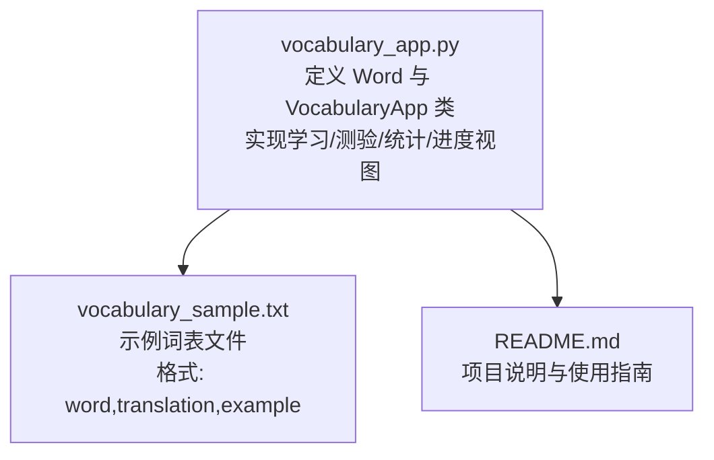
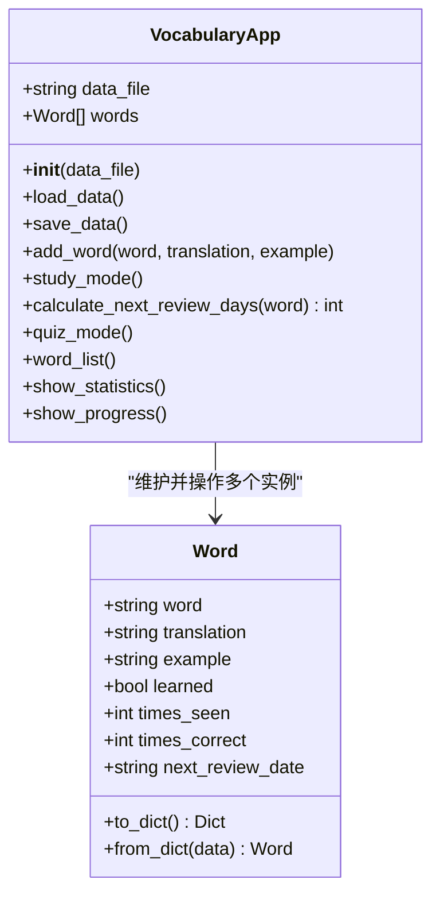
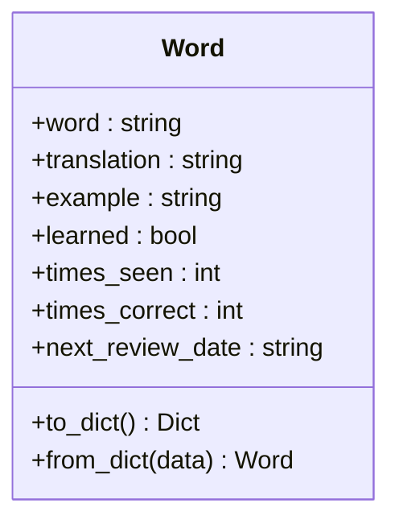
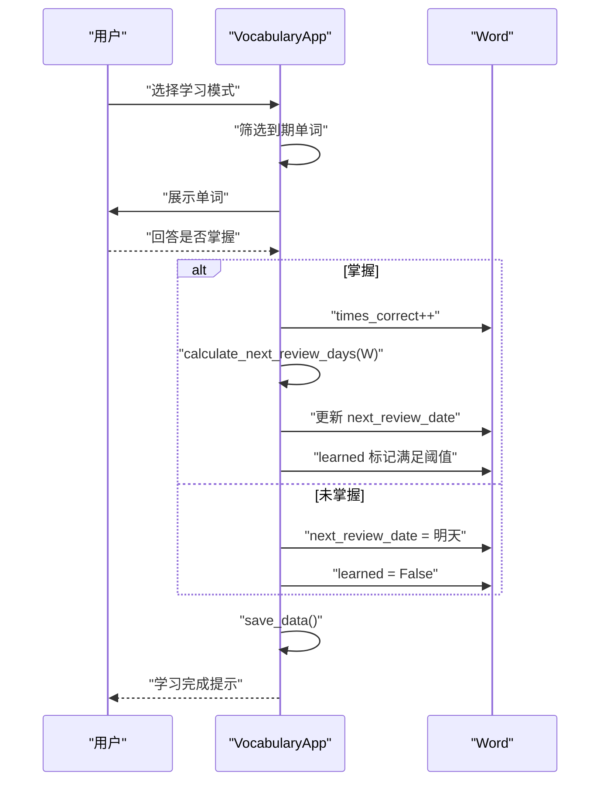
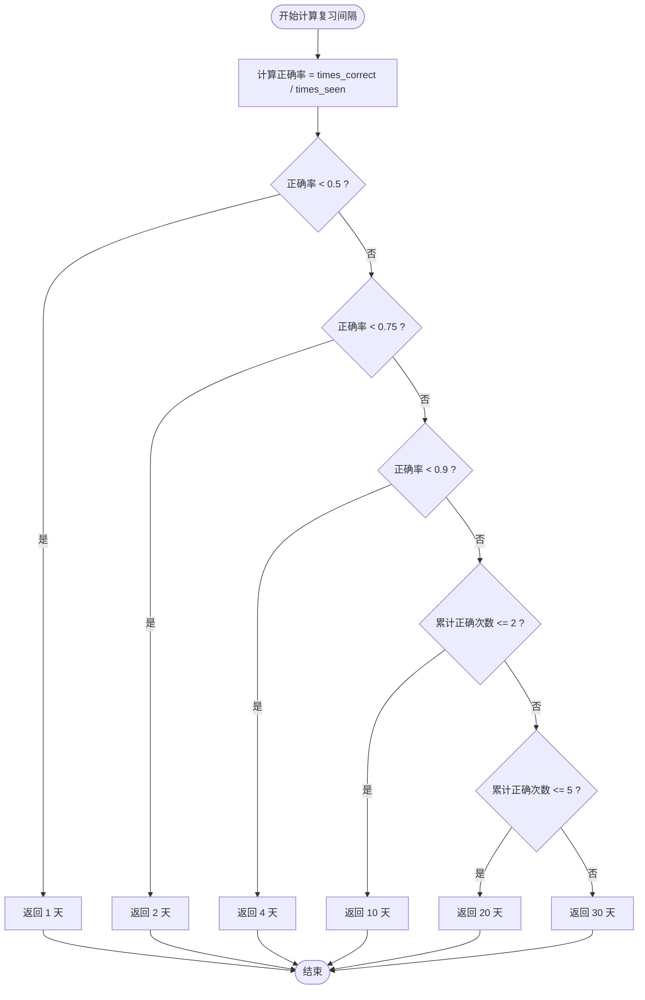
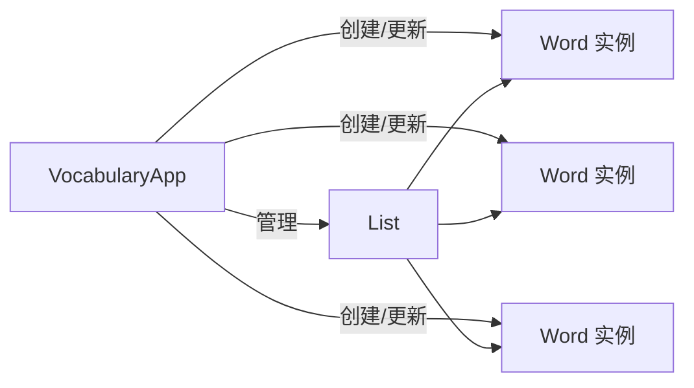
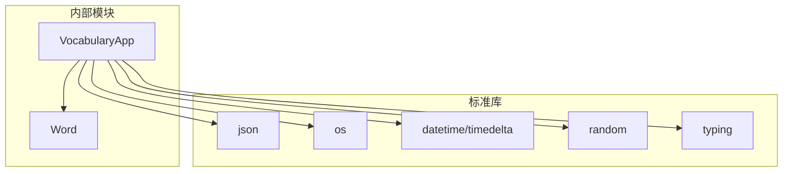

# 核心类说明

<cite>
**本文引用的文件**
- [vocabulary_app.py](file://vocabulary_app.py)
- [README.md](file://README.md)
- [vocabulary_sample.txt](file://vocabulary_sample.txt)
</cite>

## 目录
1. [引言](#引言)
2. [项目结构](#项目结构)
3. [核心组件](#核心组件)
4. [架构总览](#架构总览)
5. [详细组件分析](#详细组件分析)
6. [依赖分析](#依赖分析)
7. [性能考虑](#性能考虑)
8. [故障排查指南](#故障排查指南)
9. [结论](#结论)

## 引言
本文件聚焦于代码库中的两个核心类：Word 和 VocabularyApp。前者用于表示单个词汇及其学习状态，后者作为主控制器负责数据持久化、单词管理、学习与测验模式的业务流程，以及基于间隔重复算法的复习日期计算。本文将系统阐述两者的职责边界、数据模型、序列化机制、交互关系与关键算法策略，并提供可视化图示帮助理解。

## 项目结构
该项目采用单文件应用结构，包含一个主程序入口与若干功能模块：
- vocabulary_app.py：定义 Word 类与 VocabularyApp 类，实现学习模式、测验模式、统计展示、进度概览等核心功能；同时提供命令行菜单驱动的交互界面。
- vocabulary_sample.txt：示例词表文件，用于从文本批量导入词汇。
- README.md：项目说明、特性介绍、使用方式与数据保存位置说明。

图表来源
- [vocabulary_app.py](file://vocabulary_app.py#L1-L374)
- [README.md](file://README.md#L1-L46)
- [vocabulary_sample.txt](file://vocabulary_sample.txt#L1-L33)

章节来源
- [vocabulary_app.py](file://vocabulary_app.py#L1-L374)
- [README.md](file://README.md#L1-L46)

## 核心组件
本节概述两个核心类的职责与数据模型。

- Word 类
  - 职责：封装单个词汇及其翻译、例句与学习状态信息，支持以字典形式进行 JSON 序列化与反序列化。
  - 关键属性（均来自构造函数参数与默认值）：
    - word: 字符串，英文单词
    - translation: 字符串，中文翻译
    - example: 字符串，可选的例句
    - learned: 布尔值，是否已掌握
    - times_seen: 整数，见过次数
    - times_correct: 整数，正确次数
    - next_review_date: 字符串，ISO 日期格式的下次复习日期
  - 序列化方法：
    - to_dict：返回包含上述字段的字典，便于写入 JSON 文件
    - from_dict：从字典重建 Word 实例，兼容缺失字段（使用默认值）

- VocabularyApp 类
  - 职责：主控制器，负责数据加载/保存、单词管理、学习与测验模式、统计与进度展示。
  - 关键职责：
    - 数据加载/保存：通过 load_data 与 save_data 读取/写入 vocabulary.json
    - 单词管理：add_word 添加新词，避免重复（大小写不敏感）
    - 学习模式：study_mode 按到期日期筛选待复习单词，引导用户确认掌握情况，更新复习间隔与学习状态
    - 测验模式：quiz_mode 随机抽取单词进行多选测验，更新正确/见过次数
    - 统计与进度：show_statistics 展示总体进度与准确率；show_progress 汇总未来复习安排
    - 间隔重复：calculate_next_review_days 基于正确率与累计正确次数动态计算下次复习间隔

章节来源
- [vocabulary_app.py](file://vocabulary_app.py#L13-L49)
- [vocabulary_app.py](file://vocabulary_app.py#L51-L374)

## 架构总览
下图展示了主控制器 VocabularyApp 与数据模型 Word 的关系，以及主要流程（加载、学习、测验、保存）：

图表来源
- [vocabulary_app.py](file://vocabulary_app.py#L13-L49)
- [vocabulary_app.py](file://vocabulary_app.py#L51-L374)

## 详细组件分析

### Word 类分析
- 数据模型与类型
  - word: str
  - translation: str
  - example: str（可空）
  - learned: bool
  - times_seen: int
  - times_correct: int
  - next_review_date: str（ISO 日期字符串）
- 序列化策略
  - to_dict：将对象属性打包为字典，供 JSON 写入
  - from_dict：从字典重建对象，对缺失字段使用默认值，确保向后兼容
- 设计要点
  - 构造函数提供默认值，保证实例在不同场景下的可用性
  - 序列化接口简单明确，便于持久化与迁移

图表来源
- [vocabulary_app.py](file://vocabulary_app.py#L13-L49)

章节来源
- [vocabulary_app.py](file://vocabulary_app.py#L13-L49)

### VocabularyApp 类分析
- 初始化与数据生命周期
  - __init__：设置数据文件名并调用 load_data
  - load_data：若存在数据文件则读取 JSON 并转换为 Word 列表；否则创建示例词表并保存
  - save_data：将当前内存中的 Word 列表序列化为 JSON 并写入文件
- 单词管理
  - add_word：检查重复（忽略大小写），添加新词并立即保存
- 学习模式 study_mode
  - 筛选到期单词（next_review_date 小于等于今日）
  - 随机打乱顺序，逐个展示单词、翻译与例句
  - 用户反馈后更新 times_correct/times_seen/learned/next_review_date
  - 保存更新后的数据
- 测验模式 quiz_mode
  - 至少 4 个单词才允许测验
  - 随机抽取最多 10 个单词，生成 3 个干扰项 + 正确答案
  - 解析用户输入，统计得分并更新学习记录
  - 保存更新后的数据
- 统计与进度
  - show_statistics：统计总数、已掌握数量、待复习数量、总体准确率与平均掌握度
  - show_progress：按日期分组统计未来复习安排
- 间隔重复算法 calculate_next_review_days
  - 基于正确率与累计正确次数决定复习间隔
  - 策略分支：
    - 正确率低：短期复习（1 天）
    - 正确率中等：稍长间隔（2 天）
    - 正确率较高但次数较少：较长间隔（4/10/20 天）
    - 正确次数较多：更长间隔（30 天）
  - 学习标记：当累计正确次数达到阈值时标记为已掌握

图表来源
- [vocabulary_app.py](file://vocabulary_app.py#L108-L159)
- [vocabulary_app.py](file://vocabulary_app.py#L160-L176)

图表来源
- [vocabulary_app.py](file://vocabulary_app.py#L160-L176)

章节来源
- [vocabulary_app.py](file://vocabulary_app.py#L51-L374)

### 两个类的关系与协作
- 维护关系：VocabularyApp 持有 Word 对象列表，负责创建、更新与持久化
- 控制关系：VocabularyApp 在学习/测验流程中驱动 Word 的状态变更
- 序列化关系：通过 Word.to_dict 与 Word.from_dict 实现 JSON 序列化，由 VocabularyApp 的 load_data/save_data 统一调度

图表来源
- [vocabulary_app.py](file://vocabulary_app.py#L51-L374)

章节来源
- [vocabulary_app.py](file://vocabulary_app.py#L51-L374)

## 依赖分析
- 内部依赖
  - VocabularyApp 依赖 Word 的序列化接口（to_dict/from_dict）
  - VocabularyApp 依赖 datetime/timedelta 进行日期计算
  - VocabularyApp 依赖 random 进行随机抽样与打乱
- 外部依赖
  - json：用于读写 vocabulary.json
  - os：用于检测文件是否存在
  - typing：类型注解（List/Dict/Optional）

图表来源
- [vocabulary_app.py](file://vocabulary_app.py#L1-L374)

章节来源
- [vocabulary_app.py](file://vocabulary_app.py#L1-L374)

## 性能考虑
- 数据规模
  - load_data/save_data 会一次性读取/写入全部单词，适合中小规模词表
- 算法复杂度
  - study_mode/quiz_mode 中的筛选与遍历为线性复杂度 O(n)
  - calculate_next_review_days 为常数时间 O(1)
- I/O 优化建议
  - 若词表较大，可考虑延迟加载或分页展示
  - 批量写入（当前已通过一次 dump 实现）已较高效

## 故障排查指南
- 数据文件异常
  - 现象：启动时报错或词表为空
  - 排查：确认 vocabulary.json 是否存在且可读写；检查 JSON 格式是否合法
  - 参考路径：[load_data](file://vocabulary_app.py#L59-L84)，[save_data](file://vocabulary_app.py#L85-L92)
- 导入文件格式错误
  - 现象：无法从 vocabulary_sample.txt 导入
  - 排查：确认文件编码为 UTF-8，每行格式为“word,translation,example”
  - 参考路径：[README.md](file://README.md#L32-L46)，[vocabulary_sample.txt](file://vocabulary_sample.txt#L1-L33)
- 学习模式无单词可复习
  - 现象：提示“今日无需复习”
  - 排查：确认单词的 next_review_date 是否已过期；检查日期格式是否为 ISO 字符串
  - 参考路径：[study_mode](file://vocabulary_app.py#L108-L159)
- 测验模式提示词数不足
  - 现象：提示至少需要 4 个单词
  - 排查：先添加更多单词后再进行测验
  - 参考路径：[quiz_mode](file://vocabulary_app.py#L177-L224)

章节来源
- [vocabulary_app.py](file://vocabulary_app.py#L59-L92)
- [README.md](file://README.md#L32-L46)
- [vocabulary_sample.txt](file://vocabulary_sample.txt#L1-L33)

## 结论
本项目通过简洁的数据模型与清晰的控制流实现了高效的词汇学习辅助工具。Word 类专注于单条词汇的学习状态建模与序列化，VocabularyApp 类承担主控制器职责，统一管理数据持久化、单词增删与学习/测验流程，并以间隔重复算法提升记忆效率。两者配合良好，具备良好的扩展性与可维护性。