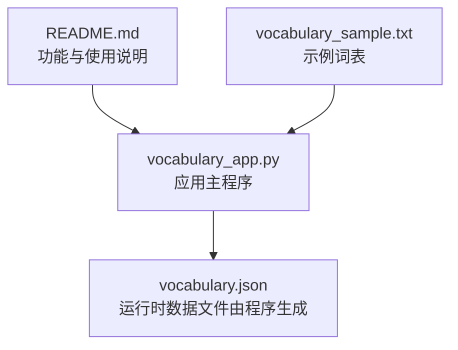
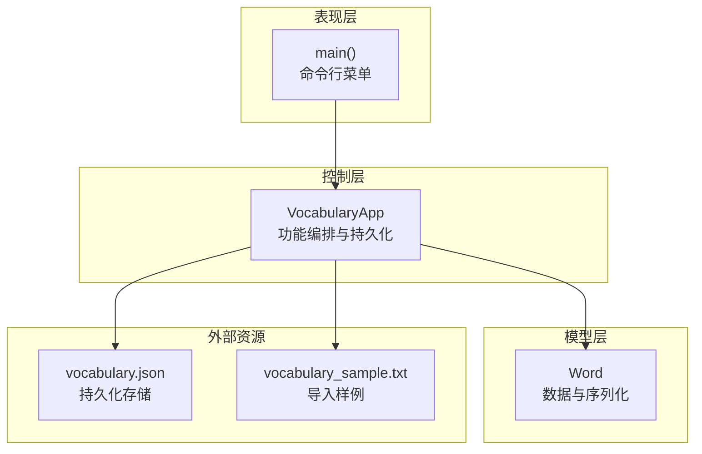
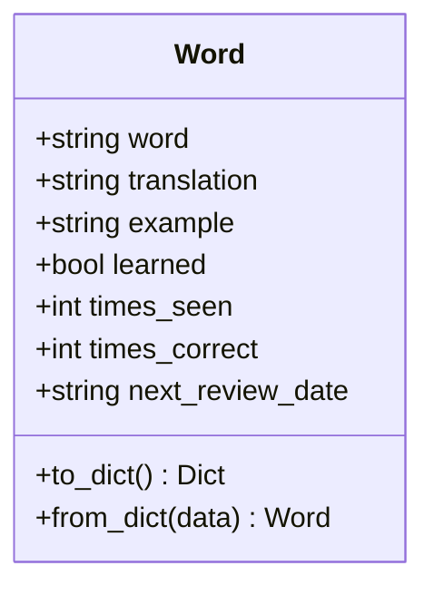
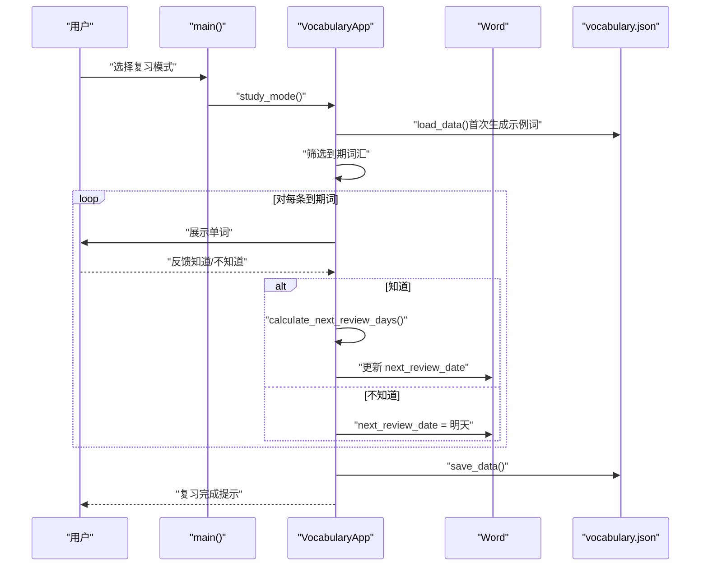
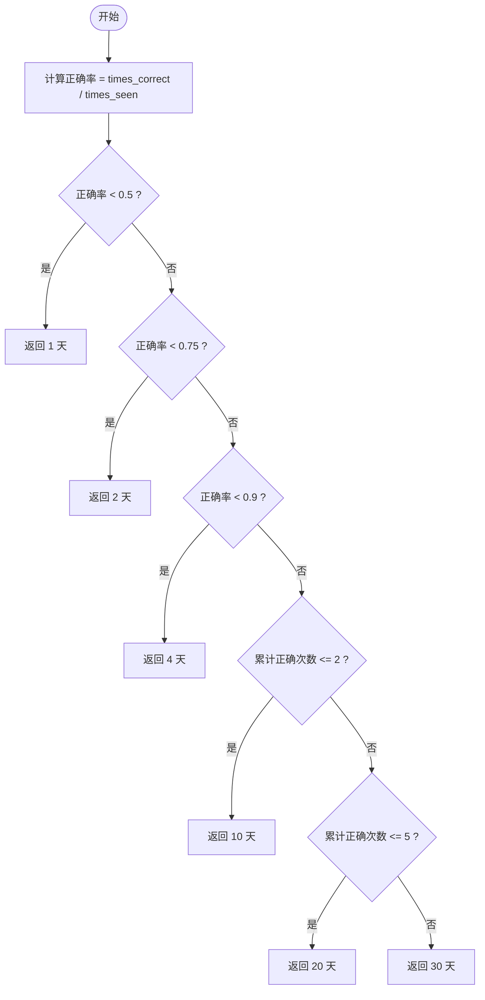
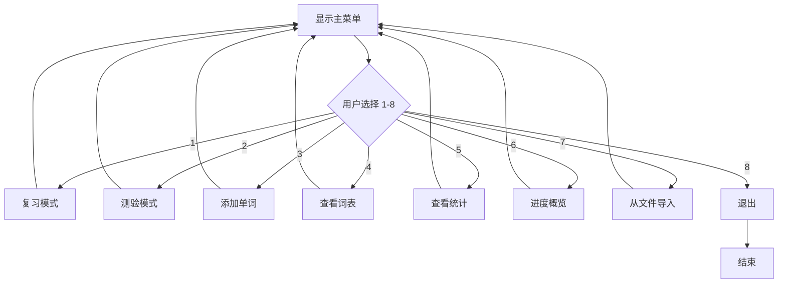
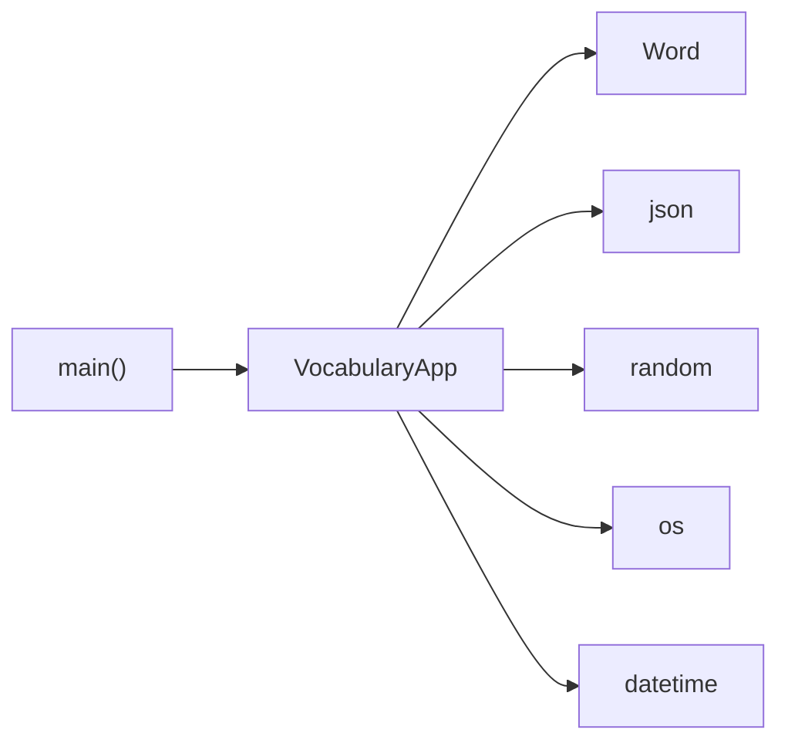

# 项目概述

<cite>
**本文引用的文件**
- [README.md](file://README.md)
- [vocabulary_app.py](file://vocabulary_app.py)
- [vocabulary_sample.txt](file://vocabulary_sample.txt)
</cite>

## 目录
1. [引言](#引言)
2. [项目结构](#项目结构)
3. [核心组件](#核心组件)
4. [架构总览](#架构总览)
5. [详细组件分析](#详细组件分析)
6. [依赖关系分析](#依赖关系分析)
7. [性能考量](#性能考量)
8. [故障排查指南](#故障排查指南)
9. [结论](#结论)
10. [附录](#附录)

## 引言
本项目是一个基于 Python 的背单词应用，旨在帮助用户通过科学的记忆方法高效掌握词汇。应用以“间隔重复”为核心机制，结合命令行交互界面，提供“复习模式”“测验模式”“词汇管理”“统计与进度”等能力，覆盖从入门到进阶的学习路径。项目强调以最小实现达成最大效果：仅使用 Python 标准库完成数据持久化、随机抽题与日期计算，确保易部署、可移植且易于理解。

## 项目结构
仓库采用极简结构，包含一个主程序入口、一份示例词表与一份说明文档：
- vocabulary_app.py：应用主体，包含词类定义、应用控制器与命令行菜单逻辑
- vocabulary_sample.txt：示例词表，用于导入功能演示
- README.md：功能特性、使用方式与保存策略说明

图表来源
- [README.md](file://README.md#L1-L46)
- [vocabulary_app.py](file://vocabulary_app.py#L1-L374)
- [vocabulary_sample.txt](file://vocabulary_sample.txt#L1-L33)

章节来源
- [README.md](file://README.md#L1-L46)
- [vocabulary_app.py](file://vocabulary_app.py#L1-L374)
- [vocabulary_sample.txt](file://vocabulary_sample.txt#L1-L33)

## 核心组件
- 词模型（Word）
  - 职责：封装单个单词及其翻译、例句、学习状态与复习计划
  - 关键字段：单词、翻译、例句、是否已掌握、见过次数、答对次数、下次复习日期
  - 序列化：支持字典化与反序列化，便于 JSON 存储与加载
- 应用控制器（VocabularyApp）
  - 数据加载与保存：从 JSON 文件读取或写入词列表；首次运行时生成示例词并初始化数据文件
  - 功能模块：
    - 复习模式（Study Mode）：筛选到期词汇，按随机顺序展示，依据用户反馈动态调整复习间隔
    - 测验模式（Quiz Mode）：随机抽取题目，生成干扰项，评估用户掌握程度并更新学习记录
    - 词汇管理：添加新词（去重）、从文件导入、查看列表与进度概览
    - 统计与进度：统计总体掌握度、准确率、待复习数量与复习日程分布
- 命令行交互（main）
  - 提供主菜单与选项分支，调用应用控制器对应功能

章节来源
- [vocabulary_app.py](file://vocabulary_app.py#L13-L49)
- [vocabulary_app.py](file://vocabulary_app.py#L51-L159)
- [vocabulary_app.py](file://vocabulary_app.py#L160-L224)
- [vocabulary_app.py](file://vocabulary_app.py#L225-L321)
- [vocabulary_app.py](file://vocabulary_app.py#L322-L374)

## 架构总览
应用采用“面向对象 + 命令行驱动”的轻量架构：
- 模型层：Word 类承载数据与序列化
- 控制器层：VocabularyApp 负责业务流程与数据持久化
- 表现层：main 函数提供菜单与输入输出
- 外部依赖：仅使用 Python 标准库（json、random、os、datetime），无第三方包

图表来源
- [vocabulary_app.py](file://vocabulary_app.py#L51-L321)
- [vocabulary_app.py](file://vocabulary_app.py#L322-L374)
- [vocabulary_sample.txt](file://vocabulary_sample.txt#L1-L33)

## 详细组件分析

### 词模型（Word）分析
- 设计要点
  - 字段覆盖“学习关键信息”，便于后续统计与复习调度
  - 提供 to_dict/from_dict，简化 JSON 序列化与反序列化
- 复杂度与性能
  - 序列化/反序列化为 O(1)，适合小规模词表
- 错误处理
  - 反序列化时未显式抛错，但构造函数默认值保证健壮性

图表来源
- [vocabulary_app.py](file://vocabulary_app.py#L13-L49)

章节来源
- [vocabulary_app.py](file://vocabulary_app.py#L13-L49)

### 应用控制器（VocabularyApp）分析
- 数据加载与保存
  - 首次运行：若不存在数据文件，则生成示例词并保存
  - 加载失败：捕获异常并回退为空列表，保证程序可用
- 复习模式（Study Mode）
  - 过滤策略：仅展示“到期”词汇（next_review_date ≤ 今日）
  - 交互流程：随机打乱、逐步展示、等待用户反馈
  - 间隔调整：依据正确率与累计正确次数，计算新的复习间隔并更新 next_review_date
- 测验模式（Quiz Mode）
  - 抽题策略：随机选取若干单词（最多 10），生成 3 个干扰项
  - 评分与记录：根据选择更新 times_seen/times_correct，并持久化
- 词汇管理与视图
  - 添加新词：大小写不敏感去重
  - 列表与进度：按“是否掌握 + 下次复习日期”排序，直观显示待复习情况
  - 导入功能：从文本文件批量添加（遵循指定格式）

图表来源
- [vocabulary_app.py](file://vocabulary_app.py#L108-L159)
- [vocabulary_app.py](file://vocabulary_app.py#L160-L176)
- [vocabulary_app.py](file://vocabulary_app.py#L85-L92)

章节来源
- [vocabulary_app.py](file://vocabulary_app.py#L59-L92)
- [vocabulary_app.py](file://vocabulary_app.py#L108-L159)
- [vocabulary_app.py](file://vocabulary_app.py#L160-L176)
- [vocabulary_app.py](file://vocabulary_app.py#L177-L224)
- [vocabulary_app.py](file://vocabulary_app.py#L225-L321)

### 复习间隔算法（Spaced Repetition）流程
- 输入：某单词的 times_seen、times_correct
- 输出：下次复习距离今天的天数
- 规则要点
  - 正确率低时缩短间隔，强化巩固
  - 正确率提升后逐步延长间隔，减少无效重复
  - 达到一定正确次数后进入更长周期，稳定记忆
- 复杂度：O(1)，常数时间判断

图表来源
- [vocabulary_app.py](file://vocabulary_app.py#L160-L176)

章节来源
- [vocabulary_app.py](file://vocabulary_app.py#L160-L176)

### 命令行交互与菜单流程
- 主菜单提供 8 个选项，分别对应不同功能
- 输入校验与错误提示：对空输入、非法选择进行提示
- 退出流程：优雅结束并感谢用户

图表来源
- [vocabulary_app.py](file://vocabulary_app.py#L322-L374)

章节来源
- [vocabulary_app.py](file://vocabulary_app.py#L322-L374)

## 依赖关系分析
- 内部耦合
  - main 依赖 VocabularyApp 的全部功能
  - VocabularyApp 依赖 Word 的序列化接口
- 外部依赖
  - json：用于词表持久化
  - random：用于复习与测验的随机化
  - os：用于检测数据文件是否存在
  - datetime：用于日期比较与间隔计算
- 依赖可视化

图表来源
- [vocabulary_app.py](file://vocabulary_app.py#L1-L12)
- [vocabulary_app.py](file://vocabulary_app.py#L322-L374)

章节来源
- [vocabulary_app.py](file://vocabulary_app.py#L1-L12)
- [vocabulary_app.py](file://vocabulary_app.py#L322-L374)

## 性能考量
- 数据规模
  - 词表以 JSON 数组形式存储，适合小中型学习集；大规模时建议分批导入或拆分词表
- 复杂度
  - 复习与测验的筛选、排序与 IO 操作均为线性复杂度，满足日常使用
- 随机化
  - 复习与测验均使用随机化，避免机械记忆；注意在自动化脚本中可固定随机种子以复现实验结果
- I/O 优化
  - 当前每次操作均进行完整读写；若词表较大，可考虑增量更新与缓存策略

## 故障排查指南
- 无法加载数据
  - 现象：启动时报错或词表为空
  - 排查：确认数据文件存在且可读；检查 JSON 格式是否合法
  - 参考路径：[数据加载逻辑](file://vocabulary_app.py#L59-L92)
- 保存失败
  - 现象：修改后重启发现数据未更新
  - 排查：检查写权限与磁盘空间；确认编码设置
  - 参考路径：[数据保存逻辑](file://vocabulary_app.py#L85-L92)
- 导入失败
  - 现象：从文件导入后无新增词
  - 排查：确认文件格式符合“单词,翻译,例句”；文件名输入是否正确
  - 参考路径：[导入调用与提示](file://vocabulary_app.py#L361-L366)、[示例词表格式说明](file://README.md#L32-L43)
- 复习间隔异常
  - 现象：复习过于频繁或过少
  - 排查：核对正确率与累计正确次数；确认日期格式一致
  - 参考路径：[复习间隔计算](file://vocabulary_app.py#L160-L176)

章节来源
- [vocabulary_app.py](file://vocabulary_app.py#L59-L92)
- [vocabulary_app.py](file://vocabulary_app.py#L85-L92)
- [vocabulary_app.py](file://vocabulary_app.py#L361-L366)
- [README.md](file://README.md#L32-L43)
- [vocabulary_app.py](file://vocabulary_app.py#L160-L176)

## 结论
本项目以“间隔重复”为核心，结合 Python 标准库实现了简洁高效的背单词工具。其命令行交互直观、功能完备，覆盖了从“背诵—测试—管理—统计”的完整学习闭环。对于初学者，项目提供了清晰的背景知识与上手路径；对于有经验的开发者，项目展示了如何用最少依赖构建可维护、可扩展的学习应用。

## 附录
- 使用说明与文件格式
  - 运行方式与菜单选项参见：[使用说明](file://README.md#L17-L31)
  - 导入文件格式与示例参见：[导入格式](file://README.md#L32-L43)
- 示例词表
  - 可直接导入使用的示例词表参见：[示例词表](file://vocabulary_sample.txt#L1-L33)